# TechMart — Scalable Full-Stack E-Commerce Platform

TechMart is a high-performance, full-stack e-commerce web application engineered with a decoupled client-server architecture using the **MERN** stack (**M**ongoDB, **E**xpress.js, **R**eact, **N**ode.js). It integrates secure transaction processing, real-time AI assistance, concurrency-optimized media uploads, and cryptographic two-factor authentication (2FA).

Designed with robust **Object-Oriented Analysis and Design (OOAD)** principles, stateless API interfaces, and defensive security measures, this codebase serves as a reference implementation for scalable, payment-centric software engineering.

🚀 **Live Access / Production Demo**: [techmart-weld.vercel.app](https://techmart-weld.vercel.app/)

---

## 🏗️ System Architecture & OOAD Design

The project is structured under strict separation of concerns, employing the **MVC (Model-View-Controller)** structural pattern and a pipeline of middleware handlers to enforce security, validation, and request processing.

### Component Design (UML Data Flow)
The following sequence diagram outlines the **Secure Payment Verification & Order Fulfillment Flow**, illustrating how the application processes transactions securely using cryptographic signature verification (aligning with transactional security standards like those at **Escrow Stack**):

```mermaid
sequenceDiagram
    autonumber
    actor User as Buyer (React Client)
    participant Server as Express API Server
    participant DB as MongoDB Database
    participant Stripe as Stripe Payment Gate
    
    User->>Server: POST /api/orderpayment/create-checkout-session
    note over Server: Extract Cart, Shipping, & Metadata
    Server->>Stripe: stripe.checkout.sessions.create()
    Stripe-->>Server: Return Session Object (ID)
    Server-->>User: JSON Response (Session ID)
    User->>Stripe: Redirect to Stripe Hosted Checkout
    User->>Stripe: Complete Secure Payment
    Stripe-->>User: Redirect to /payment/complete?session_id={ID}
    
    note over Stripe: Async Webhook Trigger
    Stripe->>Server: POST /api/orderpayment/webhook (with stripe-signature)
    rect rgb(30, 41, 59)
        note over Server: Webhook Cryptographic Verification<br/>stripe.webhooks.constructEvent(body, sig, secret)
    end
    alt Signature is Valid & Event = checkout.session.completed
        Server->>DB: Save New Order (paymentStatus: "paid")
        DB-->>Server: Acknowledge Write
        Server-->>Stripe: 200 OK (Received)
    else Invalid Signature
        Server-->>Stripe: 400 Bad Request
    end

    User->>Server: POST /api/orderpayment/payment/complete?session_id={ID}
    Server->>DB: Find/Update Order Status
    Server-->>User: 200 Success (Fulfill UI transition)
```



### Software Design Patterns Applied
1. **Middleware Filter Pipeline Pattern**: Requests pass through cascading layers for CORS policies, JSON parsing, error boundaries, and JWT verification before hitting controllers.
2. **Decoupled Stateless REST Architecture**: All backend controllers communicate via JSON. This ensures the API endpoints are fully compatible with future mobile applications built using **React Native and Expo**.
3. **Data Access Object (DAO) Pattern**: Mongoose schemas serve as isolated models handling collection schemas, index definitions, and validation rules.

---

## ⚡ Key Technical Features & Algorithmic Optimizations

### 1. Concurrency-Controlled Cloud Asset Uploads
When creating new products with multiple images, naive parallel processing can flood the network interface or trigger rate-limits on cloud providers.
- **Optimization**: Utilizing **Promise-concurrency limiting** via `p-limit` in [product.js](file:///c:/Users/91935/Desktop/PROJECTS KIRAN V/e-commerce-website/server/routes/product.js#L59-L77):
  ```javascript
  const limit = pLimit(2); // Restricts concurrent uploads to 2 tasks at a time
  const imagesToUpload = req.body.images.map((image) => {
    return limit(async () => {
      const result = await cloudinary.uploader.upload(image);
      return result;
    });
  });
  const uploadStatus = await Promise.all(imagesToUpload);
  ```
- **Complexity**: Reduces peak network throughput from $O(N)$ (where $N$ is the number of images) to a controlled $O(C)$ concurrency constant ($C=2$), preventing resource starvation.

### 2. Cryptographic Security & OTP (2FA) Lifecycle
To prevent credential stuffing and assure customer authenticity, TechMart implements a secure One-Time Password (OTP) verification channel.
- **Security Design**:
  - OTP values are cryptographically generated using standard integer mapping:
    $$\text{OTP} = \lfloor 100,000 + R \times 900,000 \rfloor \quad (\text{where } R \in [0, 1))$$
  - Verification tokens expire after a sliding window of **5 minutes** ($t_{\text{expiry}} = t_{\text{current}} + 5\text{min}$).
  - Transmitted via SMTP using TLS-encrypted mail transports.
  - Revocation of validated OTP keys is performed in $O(1)$ database transactions upon verification to prevent replay attacks.

### 3. JWT-Based Auth & Session Cryptography
- Passwords are encrypted utilizing **Bcrypt** hashing with a work factor (salt rounds) of 10.
- Client requests are authenticated statelessly using **JSON Web Tokens (JWT)** signed via HMAC SHA-256 (`HS256`).
- Webhook endpoints verify incoming payloads using cryptographic signatures (`stripe-signature`) against a signing secret to mitigate request tampering/man-in-the-middle attacks.

---

## 🗄️ Database Schema Design (MongoDB / NoSQL)

TechMart leverages MongoDB to model highly relational data within a document-oriented structure, striking a balance between normalization and performance:

```
┌──────────────────┐            ┌──────────────────┐
│      User        │ 1        N │    CartItem      │
│ ──────────────── │───────────>│ ──────────────── │
│ - name           │            │ - productTitle   │
│ - email (Unique) │            │ - price          │
│ - password       │            │ - quantity       │
└──────────────────┘            └──────────────────┘
         │ 1
         │
         │ 1
┌──────────────────┐            ┌──────────────────┐
│     Checkout     │ 1        N │   OrderPayment   │
│ ──────────────── │───────────>│ ──────────────── │
│ - username       │            │ - username       │
│ - orderDetails   │            │ - orderDetails   │
│ - shippingDetails│            │ - paymentStatus  │
└──────────────────┘            └──────────────────┘
```

- **User Schema**: Keeps track of identity profiles. Uses mongoose virtual attributes to dynamically expose hex-string IDs, clean JSON outputs, and isolate credential fields.
- **Product Schema**: Encapsulates inventory attributes including names, descriptions, prices, stock counts, category references, images, and nested dynamic specifications.
- **Checkout & OrderPayment Schema**: Tracks transactional histories. Features structured metadata fields, Stripe-specific payment session references (`stripeSessionId`), and shipping addresses.

---

## 🛠️ Project Setup & Installation

### Prerequisites
- Node.js (v18+ recommended)
- MongoDB Database Instance (Local or Atlas)
- Cloudinary & Stripe Developer Accounts

### 1. Repository Installation
Clone the repository locally:
```bash
git clone https://github.com/Kiranv-24/E-commerce-website-TechMart.git
cd e-commerce-website
```

### 2. Backend Setup
1. Navigate to the server folder:
   ```bash
   cd server
   ```
2. Install server dependencies:
   ```bash
   npm install
   ```
3. Create a `.env` file in the root of the `/server` directory and configure the environment variables:
   ```env
   PORT=4000
   CONNECTION_STRING=your_mongodb_connection_uri
   JSON_WEB_TOKEN_SECRET_KEY=your_jwt_signing_secret
   CLIENT_BASE_URL=http://localhost:3000
   
   # Cloudinary configuration
   cloudinary_Config_Cloud_Name=your_cloud_name
   cloudinary_Config_api_key=your_api_key
   cloudinary_Config_api_secret=your_api_secret
   
   # Stripe configuration
   STRIPE_SECRET_KEY=your_stripe_secret_key
   STRIPE_WEBHOOK_SECRET=your_stripe_webhook_signing_secret
   
   # Nodemailer config (Gmail/SMTP)
   EMAIL_USER=your_email@gmail.com
   EMAIL_PASS=your_app_password
   
   # OpenAI configuration
   YOUR_OPENAI_API_KEY=your_openai_key
   ```
4. Start the server (runs on port 4000 by default):
   ```bash
   npm start
   ```

### 3. Frontend Setup
1. Open a new terminal and navigate to the client folder:
   ```bash
   cd client
   ```
2. Install frontend dependencies:
   ```bash
   npm install
   ```
3. Create a `.env` file in the root of the `/client` directory:
   ```env
   REACT_APP_BASE_URL=http://localhost:4000
   REACT_APP_STRIPE_PUBLISHABLE_KEY=your_stripe_publishable_key
   ```
4. Start the React development server (runs on port 3000 by default):
   ```bash
   npm start
   ```

---

## 🔌 Core API Endpoints Reference

| Category | Method | Endpoint | Description | Auth Required |
|---|---|---|---|---|
| **Authentication** | `POST` | `/api/user/signup` | Register a new user | No |
| | `POST` | `/api/user/Login` | Validate credentials, returns JWT | No |
| | `POST` | `/api/user/sendOtp` | Cryptographically generate & mail 2FA OTP | No |
| | `POST` | `/api/user/verifyOtp` | Validate 2FA OTP expiration and payload | No |
| **Products** | `GET` | `/api/product` | Fetch all catalog items | No |
| | `POST` | `/api/product/create` | Upload images & add product (Concurrency limit = 2) | Admin |
| **Cart** | `POST` | `/api/Cart` | Update cart items state database sync | Yes |
| **Checkout** | `POST` | `/api/orderpayment/create-checkout-session` | Initialize Stripe Checkout session | Yes |
| | `POST` | `/api/orderpayment/webhook` | Stripe payment verification webhook | Signature |
| **AI Assistant** | `POST` | `/api/chat` | Proxies prompts to OpenAI models | Yes |

---

## 📈 Key Learnings & Development Alignment
This platform demonstrates competencies that directly align with **Escrow Stack's** mission to construct secure, high-integrity protected transaction networks:
- **Transactional State Management**: Coordinating multiple async channels (Stripe sessions, MongoDB, webhook validations) to guarantee transactional integrity.
- **Defensive API Engineering**: Secure signature matching, authentication middleware guards, CORS white-listing, and environment isolation.
- **Analytical Problem Solving**: Resolving asynchronous race-conditions between user checkout redirects and asynchronous webhook callbacks by managing idempotent database writes.
